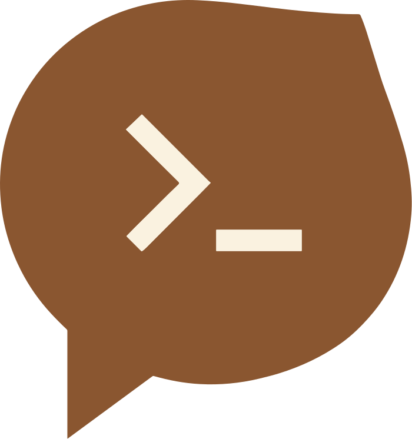

<p align="center">
  
</p>

# slacli 🌰

Slack CLI built with AI agents in mind.

## Install

### Homebrew

```bash
brew install shuntaka9576/tap/slacli
```

### From source

```bash
cargo install --path crates/slacli
```

## Setup

Initialize a profile interactively.

```bash
slacli init
```

```
Profile name: work
Profile description [-]: Work Slack workspace
User token (xoxp-...): ********
Bot token (xoxb-...): ********
```

Configuration is split into two files.

| File | Contents |
|------|----------|
| `$XDG_CONFIG_HOME/slacli/config.toml` | Profiles, channel aliases, editor |
| `$XDG_CONFIG_HOME/slacli/credentials.toml` | Tokens only (0600) |

Required Slack App scopes.

| Command | Slack API | Token | Required Scope |
|---------|-----------|-------|----------------|
| `chat send` | `chat.postMessage` | Bot | `chat:write` |
| `chat delete` | `chat.delete` | Bot | `chat:write` |
| `profile edit` | `users.profile.set` | User | `users.profile:write` |

## Usage

```bash
# Show current configuration as JSON
slacli config --see

# Send a message (--channel accepts ID or alias)
slacli chat send -c CHANNEL -t "Hello from slacli"

# Reply to a thread
ts=$(slacli chat send -c CHANNEL -t "Parent message" | jq -r '.ts')
slacli chat send -c CHANNEL -t "Thread reply" -T "$ts"

# Delete a message (ts is from chat send response or logs)
slacli chat delete -c CHANNEL -s "1710000000.000100"

# View sent message logs (JSONL output)
slacli logs --type chat-send

# View profile edit logs
slacli logs --type profile-edit

# Purge logs
slacli logs --type chat-send --purge

# Edit profile / status
slacli profile edit --set status_text="Working" --set status_emoji=":computer:"
slacli profile edit --set display_name="shuntaka"

# Agent Skills
slacli skills list
slacli skills install
slacli skills status
```

Logs are stored in `$XDG_STATE_HOME/slacli/logs/` (default: `~/.local/state/slacli/logs/`). Profile edit logs also serve as profile snapshots since `users.profile:read` scope is not granted.

### Multi-profile

Manage multiple Slack workspaces with profiles. Add more profiles with `slacli init`.

```bash
# Use a specific profile
slacli --profile personal chat send -c general -t "hello"

# Default profile is set automatically on first init
# You can change it in config.toml: default_profile = "work"
```

### Agent Skills

For Claude Code, install skills to its directory.

```bash
slacli skills install --prefix ~/.claude/skills

# If CLAUDE_CONFIG_DIR is set
slacli skills install --prefix "${CLAUDE_CONFIG_DIR}/skills"
```

### Channel Aliases

Define aliases in `config.toml` under each profile so AI agents can easily find the right channel.

```toml
[profiles.work.channels]
dev = { id = "C01ABCDEF", description = "Dev team channel" }
general = { id = "C02XYZXYZ", description = "General announcements" }
```


## Tips

Delete a message interactively with fzf.

```bash
slacli logs --type chat-send \
  | jq -r '[.ts, .channel, ._slacli_profile, .message.text] | @tsv' \
  | fzf --with-nth=4.. --prompt="Delete> " \
  | { read ts channel profile _; slacli --profile "$profile" chat delete --channel "$channel" --timestamp "$ts"; }
```

Look up past profile info from logs (`users.profile:read` scope is not granted, so logs are the only way).

```bash
slacli logs --type profile-edit | tail -1 | jq '.profile | {display_name, status_emoji, status_text}'
```

All Slack commands output raw JSON from the Slack API to stdout.

## Acknowledgements

The `skills` subcommand is inspired by [skillsmith](https://github.com/Songmu/skillsmith).
